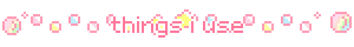

## ⋆｡‧˚ʚ🍓ɞ˚‧｡⋆

  

<h3 align="left">
  
  about me
  
</h3>

♡ pre-final year cs @ srmist, chennai ♡

 

୨ৎ research intern @ iit kharagpur

 

୨ৎ building llms • agentic rag • ai systems

 

୨ৎ linux enthusiast • networking • deep learning

<!--
**a2yshh/a2yshh** is a ✨ _special_ ✨ repository because its `README.md` (this file) appears on your GitHub profile.

Here are some ideas to get you started:

🛠️ Languages and Tools

- 🔭 I’m currently working on ...
- 🌱 I’m currently learning ...
- 👯 I’m looking to collaborate on ...
- 🤔 I’m looking for help with ...
- 💬 Ask me about ...
- 📫 How to reach me: ...
- 😄 Pronouns: ...
- ⚡ Fun fact: ...
-->
